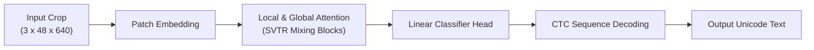

<p align="center">
  
</p>

<h1 align="center">TurkicOCR-SVTRv2-B</h1>

<p align="center">
  <b>Lightweight Line-Grounded Recognizer for Kazakh and Kyrgyz Optical Character Recognition</b>
</p>

<p align="center">
  <a href="https://opensource.org/licenses/Apache-2.0"></a>
  <a href="https://huggingface.co/alenisaw/turkicocr-svtrv2-b"></a>
  <a href="https://huggingface.co/datasets/alenisaw/turkicocr-cyrillic"></a>
  <a href="https://github.com/alenisaw/turkicocr-svtrv2-b"></a>
</p>

---

><b>TurkicOCR-SVTRv2-B</b> is a lightweight text recognition model designed for high-fidelity Cyrillic document text recognition in Kazakh and Kyrgyz. Built upon the SVTRv2-B / OpenOCR architecture (~35M parameters), it processes line-level document crops and yields precise Unicode character sequences under Connectionist Temporal Classification (CTC) sequence supervision.

This is an independent project and is not an official OpenOCR, PaddleOCR, or PaddlePaddle release. Reported end-to-end results use a shared document pipeline benchmark so that recognizers are compared under the same detection and reading-order wrapper.


## Scientific Background

While standard Cyrillic OCR models perform reasonably well on Russian text, they face severe accuracy degradation when processing low-resource Turkic languages using Cyrillic scripts, such as Kazakh and Kyrgyz. 

These languages incorporate specialized letters that do not exist in Russian:
$$\text{Kazakh / Kyrgyz Specific Characters: } \{ \text{Ә/ә, Ғ/ғ, Қ/қ, Ң/ң, Ө/ө, Ұ/ұ, Ү/ү, Һ/һ, I/i} \}$$

Because these characters are visually extremely close to base-Cyrillic letters (e.g., $\text{Қ} \rightarrow \text{К}$, $\text{Ң} \rightarrow \text{Н}$, $\text{Ө} \rightarrow \text{О}$, $\text{Ғ} \rightarrow \text{Г}$, $\text{Ұ/Ү} \rightarrow \text{У}$), generic OCR systems frequently collapse them into Russian equivalents or omit them completely. In administrative and educational workflows, a single character substitution can corrupt names, course titles, organization identifiers, or legal terms.

TurkicOCR-SVTRv2-B addresses this by learning specialized feature mappings optimized for Turkic Cyrillic glyphs and mixed Cyrillic boilerplate text.


## Pipeline and Model Architecture

TurkicOCR operates as a modular, two-stage document processing system:
1. **Layout Parsing and Detection**: Bounded text regions (lines, table cells, form fields, and zones) are localized.
2. **Text Recognition**: The `TurkicOCR-SVTRv2-B` recognizer performs fast, sequence-to-sequence text recognition on each localized crop.


### Recognizer Architecture



### Architectural Highlights
* **Visual Attention Backbone**: SVTRv2 replaces recurrent neural network blocks with a single visual attention network that interleaves local patch feature mixing with global sequence reasoning, preserving fine-grained diacritics.
* **CTC Supervision**: Connectionist Temporal Classification aligns sequence outputs without character-level segmentation or bounding boxes.
* **Inference Efficiency**: The model processes bounded region crops in a single forward pass, reaching a mean latency of 14.70 ms per crop.

## Model Hubs and Downloads

All model weights, ONNX deployment graphs, and dataset artifacts are available on both **Hugging Face Hub** and **Kaggle Models Hub**:

| Model Variant | Format | Size | Hugging Face | Kaggle Models |
|---|---|---|---|---|
| **PyTorch FP32** | `.pth` | 84.4 MB | [`alenisaw/turkicocr-svtrv2-b`](https://huggingface.co/alenisaw/turkicocr-svtrv2-b) | [`alenissayev/turkicocr-svtrv2-b/pyTorch/default`](https://www.kaggle.com/models/alenissayev/turkicocr-svtrv2-b/PyTorch/default) |
| **ONNX FP32** | `.onnx` | 74.0 MB | [`alenisaw/turkicocr-svtrv2-b-onnx`](https://huggingface.co/alenisaw/turkicocr-svtrv2-b-onnx) | [`alenissayev/turkicocr-svtrv2-b/Onnx/onnx`](https://www.kaggle.com/models/alenissayev/turkicocr-svtrv2-b/Onnx/onnx) |
| **ONNX INT8** | `.onnx` | 27.1 MB | [`alenisaw/turkicocr-svtrv2-b-int8`](https://huggingface.co/alenisaw/turkicocr-svtrv2-b-int8) | [`alenissayev/turkicocr-svtrv2-b/Onnx/onnx-int8`](https://www.kaggle.com/models/alenissayev/turkicocr-svtrv2-b/Onnx/onnx-int8) |
| **Dataset (100k pages)** | Parquet + Tar | ~42 GB | [`alenisaw/turkicocr-cyrillic`](https://huggingface.co/datasets/alenisaw/turkicocr-cyrillic) | [`alenissayev/turkicocr-cyrillic`](https://www.kaggle.com/datasets/alenissayev/turkicocr-cyrillic) |

### Option A: Download via Hugging Face

```python
from huggingface_hub import hf_hub_download

# Download PyTorch checkpoint
model_path = hf_hub_download(repo_id="alenisaw/turkicocr-svtrv2-b", filename="epoch_9.pth")

# Download ONNX FP32 model
onnx_path = hf_hub_download(repo_id="alenisaw/turkicocr-svtrv2-b-onnx", filename="model.onnx")

# Download Quantized ONNX INT8 model
int8_path = hf_hub_download(repo_id="alenisaw/turkicocr-svtrv2-b-int8", filename="model.int8.onnx")
```

### Option B: Download via Kaggle (`kagglehub`)

```python
import kagglehub

# Download PyTorch checkpoint
pytorch_dir = kagglehub.model_download("alenissayev/turkicocr-svtrv2-b/pyTorch/default")

# Download ONNX model
onnx_dir = kagglehub.model_download("alenissayev/turkicocr-svtrv2-b/other/onnx")

# Download Quantized ONNX INT8 model
int8_dir = kagglehub.model_download("alenissayev/turkicocr-svtrv2-b/other/onnx-int8")
```

## Dataset and Privacy-Preserving Design

The model is trained on the [alenisaw/turkicocr-cyrillic](https://huggingface.co/datasets/alenisaw/turkicocr-cyrillic) (large configuration) dataset:
* **Staged Splits**: 90,000 training pages, 5,000 validation pages, and 5,000 test pages.
* **Layouts**: 29 authentic document templates (forms, worksheets, exam papers, inventory lists, bilingual records).
* **Perturbations**: 7 controlled degradation profiles simulating office scans, blur, camera noise, folds, and ink bleed.

**Privacy Design**: The use of a structured synthetic supervision protocol is a deliberate privacy-preserving choice. Real administrative and educational documents contain highly sensitive Personally Identifiable Information (PII) such as addresses, identification numbers, and signatures. Synthetic generation allows for full Unicode coverage and layout complexity without exposing real-world private data.


## Experimental Evaluation

### Model Training Profile
Training convergence was monitored across final epochs to select the optimal model weights based on character error rate (CER) stability.


*Panel (a) shows aggregate CER, WER, and rare-character CER on validation samples; the red star denotes the selected optimal model. Panel (b) shows the CER trajectory separated by language groups.*

### Layout-Wise Sensitivity
Performance varies significantly depending on the layout structure. Denser layouts with short fields and complex spacing (e.g., exam papers and worksheets) present the highest recognition difficulty.


* **Hard Layouts**: Exam sheets (13.76% CER), worksheets (12.66% CER), and receipt-like pages (12.56% CER).
* **Easy Layouts**: Index pages (0.52% CER), wide schedules (1.80% CER), and registry extracts (1.89% CER).

### OCR Models Descriptive Comparison
Page-level performance was evaluated under a shared detected-page wrapper against baseline models on the independent `henrygagnier/kazakh-ocr` benchmark (1,000 pages):


As illustrated in the benchmark chart above, both the base reference model (21.31% CER, 65.50% WER) and the quantized ONNX INT8 variant (21.56% CER, 67.29% WER) of TurkicOCR-SVTRv2-B outperform all baseline systems. It reduces the Character Error Rate (CER) by more than 10% absolute compared to Kazakh TrOCR (31.96% CER) and by over 22% absolute compared to Tesseract OCR (43.52% CER). 

Standard multilingual and Cyrillic recognizers like Russian TrOCR, PP-OCR, and Cyrillic HTR fail to recognize language-specific letters and mixed-language layouts under the layout-aware reading order pipeline, resulting in high CER values exceeding 60%.


## Getting Started

### Installation
Set up a Python 3.10+ virtual environment and install the required dependencies:

```bash
# Clone the repository
git clone https://github.com/alenisaw/turkicocr-svtrv2-b.git
cd turkicocr

# Install core and inference packages
pip install -r requirements.txt
pip install -r requirements-inference.txt
```

### Quick Inference (Native Backend)
```python
import sys
import yaml
from pathlib import Path

# Set OpenOCR repository path (adjust as necessary)
openocr_root = "/path/to/openocr/repo"
sys.path.insert(0, openocr_root)
sys.path.insert(0, str(Path(openocr_root) / "tools"))

from tools.infer_rec import OpenRecognizer

# Load training configuration
config_path = "configs/train_svtrv2_b_rec.yaml"
cfg = yaml.safe_load(Path(config_path).read_text(encoding="utf-8"))

# Set path to the downloaded best.pth file
cfg["Global"]["checkpoints"] = "./best.pth"

# Initialize recognizer
recognizer = OpenRecognizer(config=cfg, mode="server", backend="torch", numId=0)

# Run prediction on an image crop (line, cell, or field)
result = recognizer(img_path="path/to/line_crop.png", batch_num=1)[0]
print("Predicted Text:", result.get("text"))
print("Confidence Score:", result.get("score"))
```


## Citation

If you use this model, dataset, or pipeline in your research, please cite:

```bibtex
@inproceedings{issayev2026turkicocr,
  title={TurkicOCR-SVTRv2-B: Lightweight Line-Grounded Recognizer for Kazakh and Kyrgyz Optical Character Recognition},
  author={Issayev, Alen and Zhalgas, Aidana},
  booktitle={Analysis of Images, Social Networks and Texts (AIST 2026)},
  series={Lecture Notes in Computer Science (LNCS)},
  publisher={Springer},
  year={2026},
  doi={10.1007/978-3-031-XXXXX-X_XX}
}

@misc{issayev2026turkicocrcyrillic,
  title={TurkicOCR Synthetic Cyrillic Dataset},
  author={Issayev, Alen},
  year={2026},
  howpublished={\url{https://huggingface.co/datasets/alenisaw/turkicocr-cyrillic}},
  doi={10.57967/hf/9255}
}
```

## License and Attribution

* **Code**: [Apache-2.0](LICENSE).
* **Dataset**: `alenisaw/turkicocr-cyrillic` (CC BY 4.0, DOI: `10.57967/hf/9255`).
* **Base Model Backbone**: OpenOCR / SVTRv2-B.
